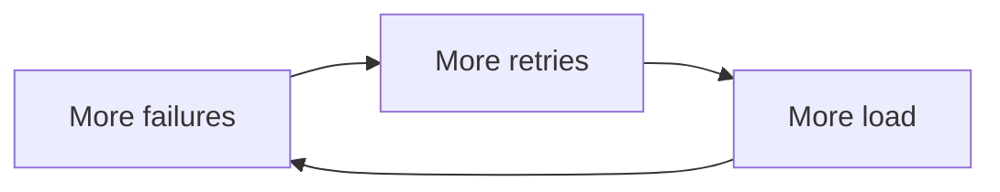
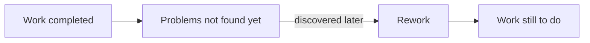
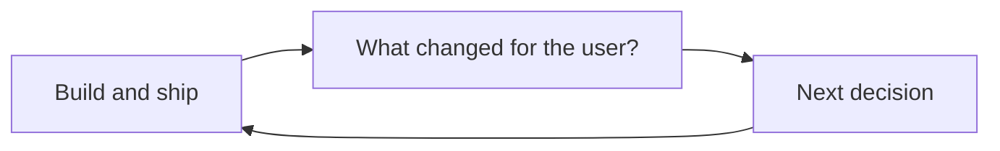
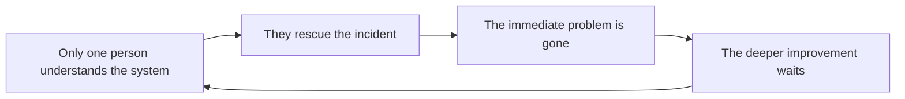

# Systems Thinking for Software Developers

**Subtitle:** Seeing the systems inside and around our code.

**Format:** 25-minute conference talk.

**Status:** New end-game draft built from the complete corpus and the decisions in `end-game-grill-decisions.md`.

## The promise

Software engineers already think in systems more than we realise. We trace dependencies, follow data through services, watch queues, and expect one change to affect another part of the application.

Formal systems thinking gives us names for some of those patterns. More importantly, it teaches us to keep widening the view: from the code, through the way it is delivered, into the tools that change the work, the product that reaches users, and the people living with the result.

This is a recognition-first talk. The audience does not need to leave able to draw a formal system-dynamics model. They should leave noticing familiar patterns sooner and asking better questions about them.

The spine is a practice, not one systems-thinking concept:

> **Do we stop at the component, or keep following the effect?**

The five concepts are tools for making different effects visible. They are not a vocabulary test. The practical promise is modest and honest: **seeing sooner is leverage**. Better seeing creates better questions, and better questions create room for a better move.

## The talk in one sentence

> Software engineers already know how to trace what code affects; systems thinking asks us not to stop tracing too early.

## The journey

> **Code → Delivery → AI → Product → People**

Each section follows the same teaching rhythm:

1. **Name it:** define one systems-thinking idea in plain language.
2. **Recognise it:** connect it to something engineers have experienced.
3. **Explain it:** make the behaviour visible with one clear diagram.
4. **Carry it forward:** leave one short question engineers can reuse.

The rhythm is consistent. The audience interaction is not. Some sections use prepared examples, some use a show of hands, and some use quiet reflection.

## Loose timing

| Section | Rehearsal guide |
| --- | ---: |
| Opening | 3 minutes |
| Code | 3 minutes |
| Delivery | 3 minutes |
| AI | 4 minutes |
| Product | 3 minutes |
| People | 4 minutes |
| Closing | 1.5 minutes |
| Natural buffer | 3.5 minutes |

Do not show these timings to the audience. They are only a rehearsal guide.

---

## Opening — Recognition, then the field, then the promise

### Start with a calm recognition beat

> “A one-line change. You were sure: an afternoon, tops. It shipped three weeks later. You have been there. Here is the strange part: the line was never the whole problem. Everything around the line was.”

Do not turn this into an incident story or a dramatic cold open. It is one familiar image that earns the wider view.

### Place the field outside software

> “There is a whole field that studies why a system keeps behaving a certain way even when the people inside it are trying to improve it.”

Systems thinking is often taught through ecology, economies, public policy, organisations, management, cities, and product design.

Its basic concern is simple:

> **Why does a system keep behaving this way, even when people inside it are trying to improve it?**

It looks beyond one event or one component. It looks at relationships, feedback, things accumulating, delays, goals, and decisions over time.

### Connect it to software

Software engineers are not starting from zero.

We already:

- trace dependencies;
- follow data and control flow;
- watch queues and capacity;
- design feedback into tests and monitoring; and
- expect a local change to affect something elsewhere.

What formal systems thinking adds is useful vocabulary and a wider, more deliberate view.

> “We usually stop tracing when we find the code path. Today, we are going to keep going—from the code all the way to the people who live with what it changes.”

### Define the overall idea

> **Systems thinking is a way to understand what keeps happening by looking at how the parts affect one another over time.**

For software, the useful boundary may include code, services, delivery work, AI tools, users, metrics, decisions, and people.

Do not teach the full vocabulary here. Introduce each idea only when the software example needs it. Say once:

> “Do not worry about collecting five new terms. Notice the move: each time, we keep following the effect.”

### Set up the journey

> “We will start inside running code. Then we will follow what changes through Delivery, AI, Product, and finally People.”

**No audience interaction in the opening.** Recognition here is a prepared story beat, not a poll. Establish the field and the promise, then move.

---

## Part 1 — Software as Code

### Name it: feedback loops

> **A feedback loop happens when the result comes back and affects what happens next.**

Use the plain definition first. Save the formal loop name until the main example is visible.

### Recognise it: two fast examples

Show these in quick succession:

1. **Fork bomb:** one process creates more processes, which create still more.
2. **Infinite re-render:** a render changes state, which causes another render.

These are recognition beats, not mini-lectures. Their job is to make “the result comes back” feel obvious.

### Explain it: retry storm

A dependency starts failing.



Say:

> “One retry can be sensible. But when every failed request creates another request, the recovery action adds load to the thing already struggling.”

Plant the person in the loop:

> “Someone wrote that retry. It was the right call—retrying a flaky call is good engineering. The loop is what turned a good call into a bad day.”

Once the audience understands the behaviour, name it:

> **Reinforcing feedback loop:** a change feeds back and creates more of the same change.

The diagram is a model to test, not proof of what caused a specific outage. In a real incident, put retry attempts, effective traffic, latency, errors, and capacity on the same timeline.

### Carry it forward

> **“What comes back and changes what happens next?”**

### Transition

> “In running code, the loop can happen in seconds. In delivery, the same kind of behaviour can take weeks—so it is much easier to miss.”

---

## Part 2 — Software as Delivery

### Name it: stocks, flows, and delays

> **A stock is something that piles up. A flow adds to it or removes from it. A delay is the wait between doing something and seeing the result.**

Use ordinary examples: a backlog, open pull requests, a test queue, or work that looks done but has not yet been tested end to end.

### Recognise it: show-of-hands poll

Ask:

> “Think about the software projects you’ve worked on. How often did they finish when you first expected them to?”

Ask for hands in sequence:

> **Always → Usually → Sometimes → Rarely → Never**

Then say:

> “Interesting. We are good engineers. We plan, estimate, track work, and learn from previous projects. So why is this still so hard?”

Do not use the poll to blame estimation, planning, managers, or engineers. Use it to create the question that the diagram answers.

### Explain it: hidden rework

Start with the clean project-plan picture:

```text
Work to do → Work completed
```

Then reveal what the plan may not show:



The key stock is **undiscovered rework**: work that appears complete while problems remain hidden. The delay is the time before those problems are found. When they return, the amount of work left rises again.

Say:

> “A plan can show what we intend to finish. It cannot show work we do not yet know is coming back.”

Plant the person in the system:

> “Someone marked that work done. They were not wrong—it looked done. The rework was hiding where no plan could show it.”

Then introduce the formal terms on the diagram:

- **Stock:** work or rework waiting in the system.
- **Flow:** work being completed, discovered, or returned.
- **Delay:** the time before we learn that something needs more work.

This is the rework-cycle shape taught in MIT’s project-dynamics material, including its software-project case. Present it as a useful mechanism to investigate, not the universal explanation for late projects.

### Video slide

After the Delivery explanation, show this video on its own slide:

- [Why software teams slow down — Uncle Bob](https://www.youtube.com/watch?v=RlNpMz6X9lc)

Do not add an interpretation, transcript, or explanatory overlay. Let the video stand on its own, then continue.

### Carry it forward

> **“Where does work keep piling up, and why do we only notice when we’re already late?”**

### Transition

> “Now imagine we make one flow much faster: creating code. Does the whole delivery system become faster with it?”

---

## Part 3 — Software with AI: an interlude across the system

AI is not the next wider boundary. It acts across Code, Delivery, Product, and People. Frame this as a deliberate gear change:

> “We have learned to follow effects through code and delivery. Now here is a force that can speed up every part of that system.”

This section asks a local question. It does not make a universal claim that AI improves or damages every software team in the same way.

### Name it: moving the bottleneck

> **Making one step faster only helps until another step becomes the limit.**

Then give the formal term:

> **A bottleneck is the part that limits the flow of the whole system.**

### Recognise it: show-of-hands sequence

Ask:

> “Who here uses AI while coding?”

Then:

> “Who feels it has made writing code faster?”

Then:

> “Who feels reviewing, understanding, testing, and shipping became equally faster?”

Pause long enough to let the difference become visible.

### Explain it: widen one pipe

Show the normal path:

```text
Create → Understand and review → Test and integrate → Run and maintain
```

Then widen only the first arrow.

```text
Create ═════▶ Understand and review → Test and integrate → Run and maintain
                    ↑ work can wait here
```

Say:

> “AI may make code creation faster. That is real. But the software is not useful merely because it was generated. It still has to be understood, reviewed, tested, integrated, operated, and maintained.”

If those later parts also improve, the whole system may move faster. If they do not, the constraint moves and work accumulates in a new place.

Plant the person in the system:

> “Someone accepted that AI-generated pull request. Faster was the whole point. The waiting did not vanish—it moved to the reviewer.”

The point is not “AI creates queues.” The point is:

> **Measure the whole path before declaring the whole system faster.**

### Carry it forward

> **“What became faster, and what became the new bottleneck?”**

### Transition

> “Even if we make the whole path faster, we still have one more question: did the software help anyone?”

---

## Part 4 — Software as Product

Name the symmetry with Code before introducing the new concept:

> “Code showed us a loop that amplifies. Product gives us a loop that can steer.”

### Name it: feedback that changes a decision

> **A balancing loop compares what is happening with what we want, then acts to close the gap.**

A useful product loop needs:

1. a signal from the user or product;
2. an idea of what “good” looks like;
3. somebody able to act; and
4. another look at the signal after the change.

### Recognise it: silent reflection

Ask the audience to think, not answer aloud:

> “Think of a feature your team shipped successfully. It worked. It was released. The ticket was closed. How did you know it actually helped anyone?”

Let the silence do the work.

Plant the person in the system:

> “Someone closed that ticket. It shipped, it worked, the ticket was green. Nobody was told whether it helped a single user.”

### Explain it: open loop versus closed loop

Start with the open path:

```text
Build → Ship → Close the ticket
```

Then add the missing return path:



Use the agreed provisional wording, clearly marked for later revision:

> **PROVISIONAL:** “Shipping tells us what we did. The user’s response tells us what changed. When that response shapes what we do next, that is a feedback loop.”

Optional formal follow-up:

> “If the response never reaches the next decision, the feedback loop is open.”

A dashboard is not automatically feedback. It becomes part of feedback when a signal reaches someone who can change what happens next.

This is the talk’s one explicit leverage demonstration:

> “The move is not to add another dashboard. Wire one useful signal back to a decision that somebody can actually make.”

### Carry it forward

> **“What changed for the user—and how will that change what we do next?”**

### Transition

> “Code does not retry itself. Work does not decide to pile up. AI does not decide what is ready to ship. People make those decisions inside the structure around them.”

---

## Part 5 — People are the destination

Collect the people planted in the earlier sections:

> “Every system today already had a person in it—the one who wrote the retry, the one who marked the work done, the one who accepted the pull request, and the one who closed the ticket. Each made a sensible choice. That is why we end here.”

People is not concept number five. This section generalises what every earlier example showed: the surrounding structure shaped a reasonable local choice.

### Name it: structure shapes behaviour

> **People respond to what the work makes easy, urgent, visible, and rewarded.**

That does not remove personal responsibility. It means that “try harder” is a poor explanation when the same behaviour keeps returning across different people.

### Recognise it: private reflection

Ask:

> “Think of the person everyone calls when something breaks. What happens when they’re not there?”

Do not ask people to identify the person or confess a team problem aloud.

### Explain it: the hero loop



Say:

> “The engineer did something valuable. Thank them. But if the same person must save the system every time, the rescue is also telling us something about the system.”

Repeated rescue can leave less time for shared knowledge, safer tools, clearer ownership, and prevention. The organisation becomes even more dependent on the next rescue.

This is where the system becomes personal. After-hours work, concentrated knowledge, and postponed improvement affect delivery capacity—but they also affect someone’s life.

Do not diagnose burnout from one incident or imply that demanding work is always harmful. The warning sign is a structure that repeatedly survives by borrowing time and attention from the same people.

### Carry it forward

> **“What behaviour does this setup reward—even by accident?”**

### Land the section

> “People are not outside the technical system. They build it, operate it, respond to its signals, and absorb its costs.”

Bring the escalating stakes into the room without overplaying them:

> “The retry cost seconds. Hidden rework cost weeks. An open product loop can cost users. A hero system can cost someone their Saturday.”

---

## Closing — Keep following the effects

Return to the opening promise and complete the cumulative path:

> **Code → Delivery → AI → Product → People**

Say:

> “Software engineers already know how to trace what code affects. Systems thinking asks us to keep following those effects—through delivery and our tools, into the product, and finally to the people living with the system.”

Do not recap five concepts or five questions. Land on the one question that binds the technical and human parts of the talk:

> **“What is the system teaching people to do?”**

Final line:

> **“Start with the code. Follow what it changes. End with the people.”**

Do not add a final exercise, pair discussion, new framework, or new example. End cleanly.

---

## Slide map

| # | Slide job | Visible content / visual | Audience move |
| ---: | --- | --- | --- |
| 1 | Title | Title and subtitle only | None |
| 2 | Create recognition | “A one-line change. Three weeks later.” | None |
| 3 | Place the field and establish familiarity | Ecology, organisations, economies, cities; then dependencies, queues, feedback | None |
| 4 | State the practice | Code → Delivery → AI → Product → People; “keep following the effect”; vocabulary is not the test | None |
| 5 | Name Code concept | Plain feedback-loop definition | None |
| 6 | Create recognition | Fork bomb and infinite re-render | Watch two quick examples |
| 7 | Explain Code | Retry-storm loop; reveal “reinforcing feedback loop” and carry question | None |
| 8 | Name Delivery concept | Stock, flow, and delay in plain language | None |
| 9 | Create recognition | Project-timing frequency question | Show of hands |
| 10 | Explain Delivery | Hidden-rework stock and delayed return flow; carry question | None |
| 11 | Video | Attribution card linking to the original Uncle Bob video | Watch video |
| 12 | Frame AI as an interlude | A force that speeds parts across the system; moving bottlenecks | None |
| 13 | Create recognition | Three AI show-of-hands questions | Show of hands |
| 14 | Explain AI | Wider creation pipe, unchanged downstream path, new queue; carry question | None |
| 15 | Name Product concept | Bookend Code: amplifying loop versus steering loop | None |
| 16 | Create recognition | “How did you know it helped anyone?” | Silent reflection |
| 17 | Explain Product | Open shipping path becomes a closed user-feedback loop; one leverage move; carry question | None |
| 18 | Make People the destination | Collect the reasonable people already present in every section | None |
| 19 | Create recognition | “What happens when the person everyone calls is not there?” | Private reflection |
| 20 | Explain People | Hero-dependency loop and escalating stakes | None |
| 21 | Close | Completed path and the central question: “What is the system teaching people to do?” | End cleanly |

Use a small cumulative **Code → Delivery → AI → Product → People** motif on section transitions. Extend or highlight one more stage each time so the talk feels like one path advancing rather than five fresh starts.

## Source trace and guardrails

- [Source bibliography](../sources/bibliography.md): the primary, authoritative, and widely respected sources supporting the systems-thinking and software-development claims in this talk.
- [Why software teams slow down — Uncle Bob](https://www.youtube.com/watch?v=RlNpMz6X9lc): linked from the attribution card on slide 11; the video itself is not embedded or republished.
- Keep the AI section framed as a question to investigate locally. The corpus does not establish one universal effect of AI-assisted development.
- Treat every causal diagram as a model to test, not proof that one mechanism explains every team or incident.
- Use short source footers on the relevant slides. Keep full qualifications in the speaker notes and written draft.
- Read every spoken sentence aloud. Rewrite anything that sounds like a report instead of one engineer talking to another.
